# 🏙️ Urban OS: The Sovereign Smart City Platform

**A Revolutionary Digital Nervous System for Modern Governance**

---

## 📖 Table of Contents
1.  [**Vision & Project Essence**](#-vision--project-essence)
2.  [**System Architecture (The Blueprints)**](#-system-architecture)
3.  [**Technology Stack (The Foundation)**](#-technology-stack)
4.  [**Exhaustive Folder Index**](#-exhaustive-folder-index)
5.  [**Core Operational Workflows**](#-core-operational-workflows)
    *   [Citizen Complaint Cycle](#-citizen-complaint-cycle)
    *   [Admin War Room Analytics](#-admin-war-room-analytics)
    *   [Real-time Emergency Response (SOS)](#-real-time-emergency-response-sos)
6.  [**Feature Deep Dives (Logic & Code)**](#-feature-deep-dives)
7.  [**Database Schema Mastery**](#-database-schema-mastery)
8.  [**API Registry (The REST Interface)**](#-api-registry)
9.  [**Deployment & DevOps**](#-deployment--devops)
10. [**Demo & Seeding Guide**](#-demo--seeding-guide)

---

## 🌟 Vision & Project Essence

Urban OS is not just an app; it is a **Sovereign Smart City Platform**. Most smart city projects fail because data is siloed. The road department doesn't know about the water leakage, and the police don't know about the streetlight failure.

**Urban OS solves this by creating a Unified Data Fabric.**

*   **For Citizens:** A one-stop interface for documentation, reporting, and emergency safety.
*   **For Admins:** A predictive "War Room" that uses AI to detect silent problems before they become catastrophes.
*   **For the City:** A scalable, modular system that can evolve with the city's growth.

---

## 🏗️ System Architecture

Urban OS follows a **Tri-Layer Distributed Architecture**:

```mermaid
graph TD
    %% Frontend Layer
    subgraph "📱 Presentation Layer (Flutter)"
        App[Citizen/Admin App]
        SocketLib[Socket.io-Client]
        GMap[Google Maps Integration]
    end

    %% Backend Layer
    subgraph "🖥️ Core Intelligence (Node.js/Express)"
        API[REST API Gateway]
        Socket[Socket.io Server]
        Auth[JWT Security]
        Middleware[Multer / Helmet / Compression]
        Controllers[Business Logic Controllers]
    end

    %% Data Layer
    subgraph "🗄️ Persistence Layer (MongoDB)"
        DB[(MongoDB Atlas)]
        UserColl[User Collections]
        ComplaintColl[Complaint Collections]
        PropertyColl[Property Collections]
        SOSColl[SOS Logs]
    end

    %% Analytics Layer
    subgraph "🧠 Analytics Microservice (FastAPI)"
        PyEngine[Python Intelligence Engine]
        MLModels[Pickle Models - Random Forest]
        Gemini[Google Gemini Integration]
    end

    %% Connections
    App -->|HTTPS| API
    App -->|WebSockets| Socket
    API -->|Mongoose| DB
    API -->|Axios| PyEngine
    PyEngine -->|PyMongo| DB
    Socket -->|Broadcasts| App
```

---

## 🛠️ Technology Stack

### 📱 Frontend (The Interface)
*   **Flutter (Dart 3.x):** Chosen for its sub-60fps UI performance and unified codebase for Android/iOS.
*   **Provider:** For state management, ensuring a reactive UI that updates instantly when backend signals change.
*   **Google Maps SDK:** The canvas for our spatial data and heatmaps.
*   **Socket.io Client:** Powering the real-time "Pulse" of the city.
*   **Dio/Http:** For robust, cancellable API requests.

### 🖥️ Backend (The Backbone)
*   **Node.js & Express:** The runtime and framework for our high-concurrency API.
*   **Mongoose:** ODM for MongoDB, providing strict schema validation.
*   **Socket.io:** Providing the bi-directional communication channel for SOS and status updates.
*   **Multer:** Specialized middleware for handling binary data (Complaints with multimedia).
*   **JWT (JSON Web Token):** Stateless authentication ensuring secure access control.
*   **SendGrid:** High-deliverability transactional email service.

### 🧠 Analytics (The Brain)
*   **Python 3.10:** The language of AI and Data Science.
*   **FastAPI:** High-performance async microservice framework.
*   **Scikit-Learn:** Hosting our predictive models for risk and population.
*   **Google Gemini Pro:** Providing LLM capabilities for the advanced chatbot.

---

## 📂 Exhaustive Folder Index

### 1. **`urban_backend/` (The Server)**
| Folder | Purpose |
| :--- | :--- |
| `src/config/` | Database and core service configurations. |
| `src/controllers/` | **The Brain.** 20+ controllers (Auth, Complaints, SOS, Property, AI). |
| `src/models/` | **The DNA.** Mongoose schemas defining every data point. |
| `src/routes/` | **The Gatekeeper.** 24 unique router files mapping URLs to logic. |
| `src/middleware/` | Auth guards, file upload filters, and security headers. |
| `src/utils/` | Shared utilities (Email, Cloudinary/Local storage, Sockets). |
| `src/intelligence/` | Advanced city monitoring sub-modules (DNA, Memory, Resilience). |
| `uploads/` | Physical storage for complaint media (Images/Audio/Video). |

### 2. **`urban_flutter/` (The App)**
| Folder | Purpose |
| :--- | :--- |
| `lib/core/` | Singletons and core configurations (API, Sockets, Constants). |
| `lib/core/providers/` | Feature-specific state managers (App, Auth, CityMonitor). |
| `lib/screens/` | 50+ screens organized by Citizen and Admin functions. |
| `lib/models/` | Data classes for serializing backend JSON into Dart objects. |
| `lib/widgets/` | Custom UI components (Glass cards, Animated buttons, Custom markers). |
| `assets/` | Global branding, animations, and typography assets. |

### 3. **`urban_analytics/` (The AI Engine)**
| Folder | Purpose |
| :--- | :--- |
| `models/` | Trained `.pkl` files for prediction. |
| `app.py` | FastAPI entry point. |
| `intelligence.py` | Data aggregation and heuristic algorithms. |
| `train_*.py` | Training scripts for various ML models. |

---

## 🔄 Core Operational Workflows

### 📢 Citizen Complaint Cycle
This workflow ensures that a citizen's voice is heard and acted upon with 100% accountability.

1.  **Entry Point:** Citizen opens `add_complaint_screen.dart`.
2.  **Input:** Captures multimedia + picks category.
3.  **GPS Lock:** `location_helper.dart` fetches sub-meter accurate coordinates.
4.  **Backend Ingestion:** `complaintController.submitComplaint` stores data.
5.  **AI Routing:** System assigns the complaint to a `ward` and `department` based on GPS.
6.  **Socket Pulse:** Admin gets a socket notification. Citizen's `my_complaints` view is updated.

### 👮 Admin War Room Analytics
How city leaders monitor the pulse of the municipality.

1.  **Dashboard Load:** Fetch global stats via `api/v1/dashboard/stats`.
2.  **Heatmap Generation:** `getHeatmapData` clusters complaint clusters into "Hotspots".
3.  **Time Filtering:** Admin toggles 24h/7d views; frontend re-requests filtered spatial data.
4.  **Intelligence Tab:** Loads `urbanDNA` and `urbanMemory` to show recurring patterns.
5.  **Action:** Admin marks status; `sendStatusUpdate` (Email) + `pushNotification` are triggered.

### 🚨 Real-time Emergency Response (SOS)
The most critical workflow, designed for zero-failure.

1.  **Trigger:** User long-passes the SOS button or shakes the phone.
2.  **Initial Alert:** `POST /api/v1/sos/trigger` sends immediate emails/SMS.
3.  **Live Stream:** App opens a dedicated socket room.
4.  **Breadcrumbs:** Coordinates are sent every 5 seconds to `UPDATE /sos/:id/location`.
5.  **Admin View:** A live marker on the Admin map moves in real-time as the citizen moves.
6.  **Deactivation:** Citizen enters PIN to cancel; summary is saved for police review.

---

*(Continuing in Part 2: Feature Deep Dives & Database Schema)*
