# 🏙️ Urban OS: The Supreme Smart City Documentation

**Version:** 3.4.0-PRO (Final Release)  
**Status:** PRODUCTION READY  
**Platform:** Multi-Layered AI-Integrated Governance OS

---

# 📖 MASTER TABLE OF CONTENTS

1.  [**PROJECT ALPHA: VISION & STRATEGY**](#-project-alpha-vision--strategy)
    *   The "Disconnected City" Problem
    *   Urban OS Solution Architecture
2.  [**TECHNICAL ARCHITECTURE (THE BLUEPRINTS)**](#-technical-architecture)
    *   High-Level System Map (Mermaid)
    *   Data Flow & Lifecycle
3.  [**CORE TECHNOLOGY STACK**](#-core-technology-stack)
    *   Frontend (Flutter 3.x)
    *   Backend (Node.js/Express)
    *   Intelligence (Python FastAPI)
    *   Database (MongoDB Atlas)
4.  [**EXHAUSTIVE FILE & DIRECTORY EXPLORER**](#-exhaustive-file--directory-explorer)
    *   Root Context
    *   Backend Directory (Sub-folder traversal)
    *   Frontend Directory (Feature-first mapping)
    *   Analytics Directory
5.  [**FEATURE DEEP-DIVES (LOGIC & WORKFLOWS)**](#-feature-deep-dives)
    *   [A1] Secure Authentication & Identity
    *   [A2] AI-Validated Complaint Pipeline
    *   [A3] High-Precision Emergency SOS
    *   [A4] Smart Property & Revenue Governance
    *   [A5] Live Heatmap & Spatial Clustering
6.  [**INTELLIGENCE LAYER (8 MODULES)**](#-intelligence-layer-8-modules)
    *   Urban Memory, Urban DNA, Silent Problems, etc.
7.  [**DATABASE REFERENCE (THE DATA DNA)**](#-database-reference)
    *   User Schema
    *   Complaint Schema
    *   Property Schema
    *   SOS Schema
8.  [**API REGISTRY (REST & WEBSOCKETS)**](#-api-registry)
    *   Registry of endpoints
    *   Socket Event Map
9.  [**DEVELOPER HANDBOOK**](#-developer-handbook)
    *   Installation Commands
    *   Environment Configuration (.env)
    *   Deployment Checklists
10. [**DEMO & MAINTENANCE SCRIPTS**](#-demo--maintenance-scripts)

---

# 🌟 PROJECT ALPHA: VISION & STRATEGY

## The "Disconnected City" Problem
In 2026, most cities suffer from **Information Asymmetry**. Citizens use Twitter for complaints, Admins use outdated Excel sheets, and Field Officers rely on scattered WhatsApp messages. There is no trace, no accountability, and no real-time data.

## Urban OS Solution
Urban OS is a **unified digital nervous system**. It turns every citizen into a sensor and every admin into an intelligence officer.

*   **Transparency:** Real-time feedback loops via Sockets.
*   **Intelligence:** Python-based ML models predicting city stress.
*   **Actionability:** Instant routing from complaint to department.

---

# 🏗️ TECHNICAL ARCHITECTURE

## High-Level System Map
The system is divided into three distinct operational layers that communicate via RESTful APIs and real-time WebSockets.

```mermaid
graph TD
    %% Citizen Interface
    User[📱 Citizen/Admin App]
    
    %% Core Services
    subgraph "Core Cloud Node (urban_backend)"
        Node[Express Server]
        SocketIO[Socket.io Engine]
        JWT[Stateless Auth Layer]
        Multer[Media Parser]
    end

    %% Intelligence Engine
    subgraph "Intelligence Node (urban_analytics)"
        FastAPI[Python FastAPI]
        Models[ML Decision Trees]
        LLM[Google Gemini Integration]
    end

    %% Data Lake
    subgraph "Persistence Node (MongoDB)"
        MDB[(MongoDB Atlas)]
        GeoJSON[Spatial Data Engine]
    end

    %% Interconnections
    User <==>|HTTPS/JSON| Node
    User <==>|Real-time Socket| SocketIO
    Node <==>|Axios Internals| FastAPI
    Node <==>|Mongoose Drivers| MDB
    FastAPI <==>|PyMongo| MDB
```

## Data Lifecycle Management
1.  **Ingestion:** Data is received via multipart/form-data (Complaints) or raw JSON (Sensors).
2.  **Validation:** Middleware checks for token integrity and payload structure.
3.  **Processing:** Backend forwards description to AI for categorization and priority weighting.
4.  **Storage:** Geo-tagged records are written to MongoDB with `2dsphere` indexing.
5.  **Broadcast:** Socket.io pushes a "New Event" signal to all subscribed administrative clients.

---

# 🛠️ CORE TECHNOLOGY STACK

## 📱 Frontend: Mobile Experience (urban_flutter)
*   **Language:** Dart 3.4.0
*   **Framework:** Flutter (Production Channel)
*   **State Management:** Provider pattern (Simple, Predictable, Performant)
*   **Maps:** Flutter Map + Google Maps integration for sub-meter resolution.
*   **Real-time:** Socket.io Client for bi-directional live streams.

## 🖥️ Backend: The Engine Room (urban_backend)
*   **Language:** JavaScript (ES6+)
*   **Runtime:** Node.js 18.x - 20.x
*   **Framework:** Express.js (High Performance)
*   **Persistence:** MongoDB Atlas (NoSQL)
*   **Encryption:** Bcryptjs 10-round salt
*   **Connectivity:** Socket.io 4.x
*   **Communication:** Axios for inter-service Python communication.

## 🧠 Intelligence: The Cognitive Layer (urban_analytics)
*   **Language:** Python 3.10
*   **Framework:** FastAPI (Asynchronous)
*   **ML Libraries:** Pandas, Scikit-learn (Random Forest, Regressors)
*   **Gen-AI:** Google Generative AI (Gemini Pro) for conversational intelligence.

---

# 📂 EXHAUSTIVE FILE & DIRECTORY EXPLORER

## 1. Root Context (`/`)
*   `README.md`: Current comprehensive documentation.
*   `SYSTEM_STATUS.md`: Real-time operational logs.
*   `READY_FOR_TESTING.md`: User-facing verification lists.
*   `fix_connection.bat`: Automated network diagnostic script.

## 2. Backend Architecture (`urban_backend/`)
### 📂 `src/controllers/` (Business Logic)
*   `authController.js`: Complete identity management (JWT, Hash, OTP).
*   `complaintController.js`: The heart of the app. Handles file uploads and AI routing.
*   `sosController.js`: Emergency trigger and location breadcrumb logic.
*   `propertyController.js`: Tax calculation and geospatial property discovery.
*   `aiController.js`: Bridge between the backend and the Python/Groq/Gemini APIs.
*   `cityMonitorController.js`: Logic for generating heatmaps and live dashboard stats.

### 📂 `src/models/` (Data DNA)
*   `User.js`: Schema for Citizens, Admins, and Officers.
*   `Complaint.js`: Multi-faceted schema with AI validation fields.
*   `Property.js`: Schema with `2dsphere` index for tax and geofencing.
*   `sosModel.js`: Record of emergency events with live telemetry.

### 📂 `src/routes/` (URL Entry Points)
*   `authRoutes.js`: Login, signup, and profile endpoints.
*   `complaintRoutes.js`: Submission, status updates, and heatmap data.
*   `adminRoutes.js`: Management of officers and global stats.
*   `sosRoutes.js`: Triggering and location streaming endpoints.

## 3. Frontend Architecture (`urban_flutter/`)
### 📂 `lib/screens/` (User Experience)
*   `auth/`: Screens for Login, Signup, and OTP.
*   `complaints/`: Screen for adding reports and the live heatmap.
*   `admin/`: The "War Room" dashboard and monitoring views.
*   `safety/`: The high-priority SOS emergency button interface.

### 📂 `lib/core/` (Singletons & Helpers)
*   `api_service.dart`: Handles all HTTP communication with retry logic.
*   `socket_service.dart`: Manages the persistent WebSocket connection.
*   `app_provider.dart`: Global state management for sessions and preferences.

---

# 🛠️ FEATURE DEEP-DIVES (LOGIC & WORKFLOWS)

## [A1] Secure Authentication & Identity
**Goal:** Zero-friction entry with maximum security.
*   **Logic:**
    1.  User enters email.
    2.  Backend generates a 6-digit numeric OTP and stores it with a 10-minute TTL in MongoDB.
    3.  User verifies OTP.
    4.  Backend returns a `citizen` or `admin` signed JWT.
*   **Security:** Passwords use 10-round Salted hashing (`bcryptjs`).
*   **File:** `src/controllers/authController.js` (Lines 1-320).

## [A2] AI-Validated Complaint Pipeline
**Goal:** Reduce spam and ensure manual review for discrepancies.
*   **Logic:**
    1.  Multimedia capture (Multer).
    2.  Coordinates fetched via GPS (`location_helper.dart`).
    3.  Description analyzed by **Groq/Llama** or **Gemini**.
    4.  Priority score (1-5) assigned based on keywords ("blood", "fire", "leak").
    5.  Validation check: `UserCategory` matches `AICategory`?
*   **Real-time:** Updates pushed via `socket.emit('new_complaint')`.
*   **File:** `src/controllers/complaintController.js` (Lines 1-500).

## [A3] High-Precision Emergency SOS
**Goal:** Sub-5 second rescue response time.
*   **Logic:**
    1.  Trigger via shake or long-press.
    2.  Immediate broadcast of "DISTRESS" signal to all Admin sockets.
    3.  Email/SMS blast to `sosEmergencyContacts` with a live Google Maps link.
    4.  Breadcrumb loop: Frontend emits coordinates every 5s; Backend updates `liveLocation`.
*   **Resilience:** Works in background mode via Persistent Socket connection.
*   **File:** `src/controllers/sosController.js` (Lines 1-450).

## [A4] Smart Property & Revenue Governance
**Goal:** 100% Tax Transparency.
*   **Logic:**
    1.  Indexed properties across city wards.
    2.  Tax calculated dynamically: `Area * ZoneRate`.
    3.  Near-me Discovery: Finds registered properties within 500m of a user to verify legality.
*   **File:** `src/controllers/propertyController.js` (Lines 1-200).

*(Continuing in Part 2: Intelligence Layer & Database Mastery)*
