# 🏙️ Urban OS - Advanced Smart City Governance Platform

**Integrating AI, Real-time Data, and Citizen Engagement**

---

## 📚 Documentation Hub

This repository contains the complete source code for **Urban OS**, a next-generation platform designed to digitize city governance. We have documented every single module in extreme detail for evaluation.

### 👇 **Start Here: Technical Deep Dives** 👇

| Module | Technology | Documentation Link |
| :--- | :--- | :--- |
| **📱 Mobile App** | Flutter (Dart) | [**View Detailed Frontend Docs ➔**](./urban_flutter/README.md) |
| **🖥️ Backend Server** | Node.js (Express) | [**View Detailed Backend Docs ➔**](./urban_backend/README.md) |
| **🧠 AI Engine** | Python (FastAPI) | [**View Detailed Analytics Docs ➔**](./urban_analytics/README.md) |

---

## 🏗️ System Architecture Diagram

```mermaid
graph TD
    User[📱 Citizen / Admin] -->|Uses App| FlutterApp[Urban Flutter App]
    
    subgraph "Core Cloud Infrastructure"
        FlutterApp -->|REST API & Socket| Backend[🖥️ Node.js Backend]
        Backend -->|Reads/Writes| DB[(🗄️ MongoDB Database)]
        Backend -->|Sends Emails| Email[📧 SendGrid Service]
    end
    
    subgraph "Intelligence Layer"
        Backend -->|Queries Intelligence| AI[🧠 Python Analytics Engine]
        AI -->|Fetches Data| DB
        AI -->|Runs Models| ML[🤖 Scikit-Learn Models]
    end
```



---

## 🌟 Executive Summary (The "Why")

Urban OS solves the **"Disconnected City"** problem. Currently, citizens complain on Twitter, Admins look at Excel sheets, and Field Officers use WhatsApp. **There is no single source of truth.**

**Urban OS unifies this into one flow:**
1.  **Detection:** A Pothole is spotted.
2.  **Reporting:** Citizen snaps a photo (Auto-tagged with GPS).
3.  **Intelligence:** AI analyzes the image, categorizes it, and assigns it to the Road Dept.
4.  **Action:** Field Officer gets a notification.
5.  **Resolution:** Officer fixes it, uploads a photo.
6.  **Verification:** Citizen confirms the fix.

---

## 🏆 Innovation Metrics (For Judges)

*   **100% Paperless Workflow:** From complaint to tax calculation.
*   **Sub-Second Latency:** Real-time SOS tracking updates.
*   **Hybrid AI Model:** Uses Rule-based checks for speed + Gen-AI for complexity.
*   **Modular Scalability:** Can add a "Traffic Module" without touching the "Water Module" code.

---

## 🚀 Master Deployment Guide

To run the **Entire System** locally:

1.  **Start Database:** Ensure MongoDB is running.
2.  **Start Intelligence Engine:**
    ```bash
    cd urban_analytics && python app.py
    ```
3.  **Start Core Backend:**
    ```bash
    cd urban_backend && npm start
    ```
4.  **Launch Mobile App:**
    ```bash
    cd urban_flutter && flutter run
    ```

---

**✨ Copyright © 2026 Team Urban OS**
*Building Smarter Cities, One Line of Code at a Time.*
