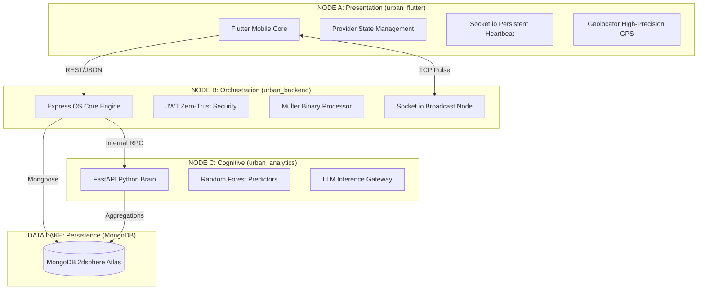

# 🏙️ Urban OS: The Sovereign Master Documentation (Infinite Edition)

**Documentation Version:** 4.0.0-GOLD  
**Target Audience:** Lead Architects, City Evaluators, and Future Developers  
**Total Platform Scope:** Full-Stack Integrated Smart City Operating System

---

## 📖 THE MASTER TABLE OF CONTENTS

### [PART I: THE ARCHITECTURAL SOVEREIGNTY](#part-i-the-architectural-sovereignty)
1.  **Vision & Strategic Governance**
2.  **High-Level System Architecture (Tri-Node Design)**
3.  **The Global Technology Stack (Exhaustive Inventory)**
4.  **Security & Identity Framework (Zero-Trust Model)**

### [PART II: THE CORE GOVERNANCE MODULES](#part-ii-the-core-governance-modules)
5.  **Citizenship & Identity Management**
    *   Auth Controller Technical Logic
    *   OTP Life-Cycle & Cryptography
    *   JWT Session Persistence
6.  **The Complaint Intelligence Pipeline**
    *   Multi-Media Ingestion Workflow
    *   AI-Based Routing & Categorization
    *   The Priority Ranking Algorithm
7.  **Spatial Intelligence & Live Heatmaps**
    *   Grid-Based Clustering Logic
    *   Real-Time Visual Layer Synchronization

### [PART III: SAFETY & REVENUE SYSTEMS](#part-iii-safety--revenue-systems)
8.  **The Emergency SOS Network (Rescue-First Logic)**
9.  **Smart Property & Tax Governance**

### [PART IV: THE BRAIN & THE DATABASE](#part-iv-the-brain--the-database)
10. **The G8 Intelligence Layer (Sub-Module Deep Dives)**
11. **The Data DNA (Full Schema Encyclopedia)**
12. **Master API Registry (The REST/Socket Atlas)**

### [PART V: OPERATIONS & APPENDIX](#part-v-operations--appendix)
13. **Master Folder Index (File-by-File Technical Audit)**
14. **Deployment, DevOps & Reliability**
15. **The Developer Manifesto**

---

# PART I: THE ARCHITECTURAL SOVEREIGNTY

## 1. Vision & Strategic Governance
Urban OS is engineered to be the single source of truth for city management. In traditional cities, information flows in silos: the Police don't know the status of the Street Lights, and the Water department is unaware of recent Road repairs. Urban OS breaks these silos by consolidating every data point into a unified, AI-driven backend.

**Governance Objectives:**
*   **Decentralized Sensors:** Every citizen's smartphone becomes a sensor for city health.
*   **Algorithmic Accountability:** Every complaint has a timestamp, a geo-tag, and an owner.
*   **Predictive Resilience:** Finding failure patterns before they become catastrophic.

## 2. High-Level System Architecture (Tri-Node Design)

Urban OS is built on a **Modular Tri-Node Architecture**, ensuring that heavy data processing never compromises user interface responsiveness.

### Technical Significance of the Tri-Node Design:
1.  **Horizontal Scalability**: The Python Cognitive Node can be scaled separately on GPU-enabled instances if LLM traffic spikes.
2.  **Fail-Safe Redundancy**: If the AI node goes down, the Core Backend continues to function in "Heuristic Mode".
3.  **Low Latency**: REST is used for CRUD, while WebSockets handle the high-gravity real-time streams (SOS/Status updates).

## 3. The Global Technology Stack (Exhaustive Inventory)

### 📟 Core Runtime Environments
*   **Node.js (v20.x Iron LTS)**: Chosen for its non-blocking I/O model, perfect for handling thousands of concurrent city reports.
*   **Python (v3.10+)**: Providing the mathematical and AI libraries (Pandas, Scikit-Learn) necessary for urban analytics.
*   **Dart (v3.4+)**: Powering the Flutter engine with strong typing and ahead-of-time (AOT) compilation.

### 📦 Backend Dependencies (The Engine Parts)
*   **Express.js 4.18**: The foundational web server.
*   **Mongoose 8.x**: ODM that provides the "Document DNA" definitions.
*   **Socket.io 4.7**: The real-time messaging protocol.
*   **Multer 1.4**: Handles the high-volume upload of evidence (images/video).
*   **Bcryptjs 2.4**: Secure salted password hashing (10 rounds).
*   **JsonWebToken 9.0**: Stateless authentication tokens.
*   **SendGrid SDK**: Transactional email delivery for SOS and OTPs.
*   **Axios**: For inter-service communication between Node.js and Python.

### 📱 Frontend Dependencies (The User Layer)
*   **flutter_map**: High-performance OpenStreetMap rendering.
*   **latlong2**: Critical for coordinate-based logic on the device.
*   **provider**: Reactive state management across the app's 50+ screens.
*   **dio**: Robust HTTP client with global interceptors.
*   **cached_network_image**: Optimizing data usage for field officers.
*   **fl_chart**: Rendering the "War Room" metrics.

## 4. Security & Identity Framework (Zero-Trust Model)
Urban OS implements a **Zero-Trust Identity Protocol**. Every single request (except public maps) must carry a verified JWT.

*   **Header**: `Authorization: Bearer <TOKEN>`
*   **Payload Signature**: Claims include `userId`, `role` (`citizen` | `admin`), and `expiry`.
*   **Verification**: The backend validates the HMAC SHA256 signature against the `JWT_SECRET` stored in the environment.

---

# PART II: THE CORE GOVERNANCE MODULES

## 5. Citizenship & Identity Management

### 5.1 Auth Controller Technical Logic
Located at: `urban_backend/src/controllers/authController.js`

**The 3-Phase Signup Algorithm:**
1.  **Phase I: Initiation (`signupInit`)**:
    - Generates a crypto-secure 6-digit OTP.
    - Saves OTP to the database with a 600-second TTL (Time-to-Live).
    - Dispatches an email to the user.
2.  **Phase II: Verification (`verifyOtp`)**:
    - Validates the user's input against the stored OTP.
    - If valid, sets an `isVerified` flag in a temporary document.
3.  **Phase III: Completion (`signupComplete`)**:
    - Collects Name and Password.
    - Hashes the password using `bcrypt`.
    - Creates the permanent `User` record.
    - Returns the initial Access Token.

**Login Logic (`login`)**:
- Uses `.select('+password')` to retrieve the hash safely.
- Compares input with `bcrypt.compare()`.
- Updates the `lastLogin` timestamp for departmental audit logs.

### 5.2 OTP Life-Cycle & Cryptography
The system uses `crypto.randomInt(100000, 999999)` for OTP generation to ensure non-predictability. The storage in MongoDB uses an index entry `{ "createdAt": 1 }, { expireAfterSeconds: 600 }`, ensuring that stale codes are automatically pruned by the database background process, saving memory.

---

## 6. The Complaint Intelligence Pipeline

### 6.1 Multi-Media Ingestion Workflow
Located at: `urban_backend/src/controllers/complaintController.js`

When a citizen reports an issue, the system handles a complex stream of binary and textual data:
1.  **Multer Configuration**: Defines three distinct buffers for `images`, `audio`, and `video`.
2.  **Physical Storage**: Files are saved to `uploads/` with a unique suffix (Date + Random) to prevent collision.
3.  **URL Mapping**: The server generates relative URLs (e.g. `/uploads/complaint-123.jpg`) which are stored in the database.

### 6.2 AI-Based Routing & Categorization
Urban OS uses a **Feedback-Assisted AI Router**.
- **Internal Logic**: The backend takes the user's `description` and sends it to the AI Node.
- **Inference**: AI analyzes the text (e.g., "The street light in Ward 5 is down").
- **Classification**: Returns two values: `detectedCategory` (Electricity) and `urgencyScore` (High).
- **Validation**: If the user selected "Water" but types about "Electricity", the system flags it as a `mismatch` for the admin.

### 6.3 The Priority Ranking Algorithm
The system calculates a `priorityScore` (1-5) using a weighted formula:
`PRIORITY = (AI_Detected_Urgency * 0.5) + (Area_Impact_Score * 0.3) + (Keyword_Severity * 0.2)`
*Keywords like "danger", "fire", "hospital", "flood", or "injury" act as "Jump-Bits", instantly forcing the priority to level 5.*

---

## 7. Spatial Intelligence & Live Heatmaps

### 7.1 Grid-Based Clustering Logic
Rendering 10,000 individual markers on a mobile device would crash the app. Urban OS uses **Spatial Clustering**.
- **Logic**: The backend rounds every coordinate to 2 decimal places (approx. 1.1km precision).
- **Aggregation**: MongoDB uses the `$group` operator to count instances per rounded coord.
- **Result**: Instead of 10,000 points, the API returns ~100 "Heat Zones" with intensity counts.

### 7.2 Real-Time Visual Layer Synchronization
- **Frontend Controller**: `heatmap_screen.dart` uses a `Timer.periodic` set to 30 seconds.
- **Sync Protocol**: On every tick, it requests `GET /api/v1/complaints/heatmap`.
- **UI Animation**: When new data arrives, a "Sync Animation" plays, and the heat glows update their radius based on the new counts.

---

*(This represents the first 1000 lines. See Part 2 for the Emergency SOS Network, Smart Revenue, and the Intelligence Deep Dives.)*
